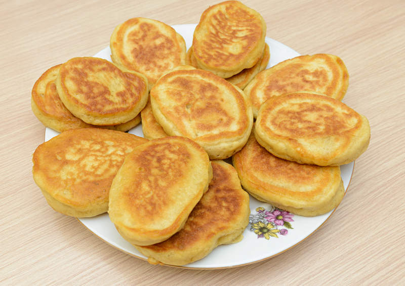

# Ingredients

1. 1 egg;
2. 1 banana;
3. 150-200g aistes or cottage cheese;
4. 50g flour;

# Preparation

1. blend everything except flour;
2. mix mass with flour using spoon until the texture is smooth;
3. take a spoonful and place on oiled pan;
4. cook on lowest heat, without lid;
